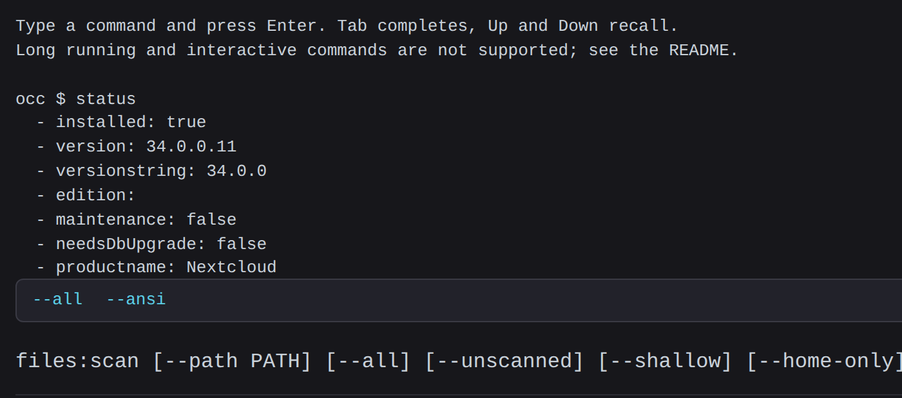

# OCCTerm

Run Nextcloud's `occ` maintenance commands from a browser terminal, without shell
access to the server.



## Using it

Type a command and press Enter. The line is coloured as you type, so you can
see what the app understood before you commit to it:

| Colour | Meaning |
|---|---|
| cyan | a command occ recognises |
| orange | an option that command accepts |
| white | an argument or a value |
| red, underlined | a name that matches nothing |

Red only appears once a word can no longer become anything valid, so a
half-typed `files:sc` stays neutral while `files:sq` is marked at once.

**Tab** completes, and works the same way in both halves of the line: command
names while you are typing the first word, that command's options afterwards.
One match is inserted; several extend to their common prefix and open a list
that narrows as you keep typing. Tab again steps through the list, Enter takes
the highlighted entry, Esc closes it.

Once a command is recognised, its usage line is shown above the prompt. That is
occ's own summary, so it is the authoritative list of what the command accepts.

**Up** and **Down** recall earlier commands. `clear` empties the transcript.

Commands that can lock you out of the interface you are typing into, such as
`maintenance:mode`, ask for confirmation first.

## Requirements

- Nextcloud 34 (`info.xml` is pinned to `min-version="34" max-version="34"`)
- PHP 8.1 or newer

## Install

### From a release

The release archive contains a single `occterm/` folder, which is what Nextcloud
expects. Extract it directly into your apps directory, then enable it.

```bash
cd /path/to/nextcloud/apps
curl -L -o occterm.tar.gz \
  https://github.com/Sunyata-Anatta/occterm/releases/download/v1.1.1/occterm-1.1.1.tar.gz
tar xzf occterm.tar.gz && rm occterm.tar.gz

sudo -u www-data php /path/to/nextcloud/occ app:enable occterm
```

Replace `www-data` with whichever user runs your web server. On some setups the
apps directory is `apps-extra/` instead; either works, as long as the folder is
named `occterm`.

If you unpack the archive as root, hand it back to the web server user or
Nextcloud will not be able to read it:

```bash
sudo chown -R www-data:www-data /path/to/nextcloud/apps/occterm
```

### From source

The repository does not carry a built frontend, so a checkout needs one build
step. Node 20, 22 or 24 is required.

```bash
cd /path/to/nextcloud/apps
git clone https://github.com/Sunyata-Anatta/occterm.git
cd occterm
npm ci && npm run build

sudo -u www-data php /path/to/nextcloud/occ app:enable occterm
```

### Confirm it works

```bash
sudo -u www-data php /path/to/nextcloud/occ app:list | grep occterm
```

Then open **OCCTerm** in the administrator navigation and run `status`. If the
page loads but stays empty, the frontend bundle is missing: check that
`js/occterm-main.js` exists, and run `npm ci && npm run build` if it does not.

### Uninstall

```bash
sudo -u www-data php /path/to/nextcloud/occ app:disable occterm
rm -rf /path/to/nextcloud/apps/occterm
```

The app stores nothing: no database tables, no configuration, no app data.
Removing the folder removes it completely.

## Security

This app runs `occ` as the web server user. Anyone who can reach it can run any
`occ` command, including ones that read and modify every user's data. Enabling it
is equivalent to handing out a shell on the server.

Access is restricted to administrators by the framework: no controller method
carries `NoAdminRequired`, so the security middleware rejects everyone else
before any application code runs. That is the only thing standing between a
logged-in user and the command line, so treat administrator accounts on an
instance running this app accordingly. Enable it when you need it, disable it
when you don't.

A short list of commands that can lock you out of the interface you are typing
into, `maintenance:mode` among them, asks for confirmation first. That is a
guard against slips, not a security boundary.

## What it cannot do

PHP gives Nextcloud no native support for asynchronous operations, so a web
terminal cannot run interactive or long-running commands:

- Commands that prompt will hang. There is no way to answer them.
- Long commands hit the PHP execution limit. `occ files:scan` on a large
  instance will fail partway, and a half-finished command can leave real damage.
- There is no streaming output. A command's transcript arrives when it finishes.

For anything in those categories, use `occ` on the command line.
[nextcloud/server#16726](https://github.com/nextcloud/server/issues/16726)
explains why this is unlikely to change.

## Will it survive the next Nextcloud release?

Probably not without a change, and that is a property of Nextcloud rather than of
this code. There is no public API for running console commands, so the one thing
this app exists to do can only be done through the server's private namespace,
which carries no compatibility guarantee. The constructor it depends on already
changed between Nextcloud 29 and 31.

The design response is containment, not a fix: every private dependency lives in
`lib/Service/OccRunner.php`, so a server-side change breaks one file whose
expected signature is recorded in `tests/stubs/nextcloud.php`.
[docs/architecture.md](docs/architecture.md) has the details.

## Development

```
composer install     # dev-only, for the tests
composer test        # 9 checks: the runner and the command index
npm ci && npm run build
npm test             # 20 checks: colouring and completion
```

Neither suite needs PHPUnit, Nextcloud, or a browser. The PHP tests run against
stub classes copied from `nextcloud/server` at `stable34`, so they check this
app's own logic and its assumptions about the server. They cannot tell you the
app works on a real instance; only installing it can.

Colouring and completion live in `src/highlight.js` as pure functions, away from
the component, which is why they can be tested without a DOM.

## Changes

[CHANGELOG.md](CHANGELOG.md) records what each release changed.

## Licence

AGPL-3.0-or-later. See [COPYING](COPYING).
